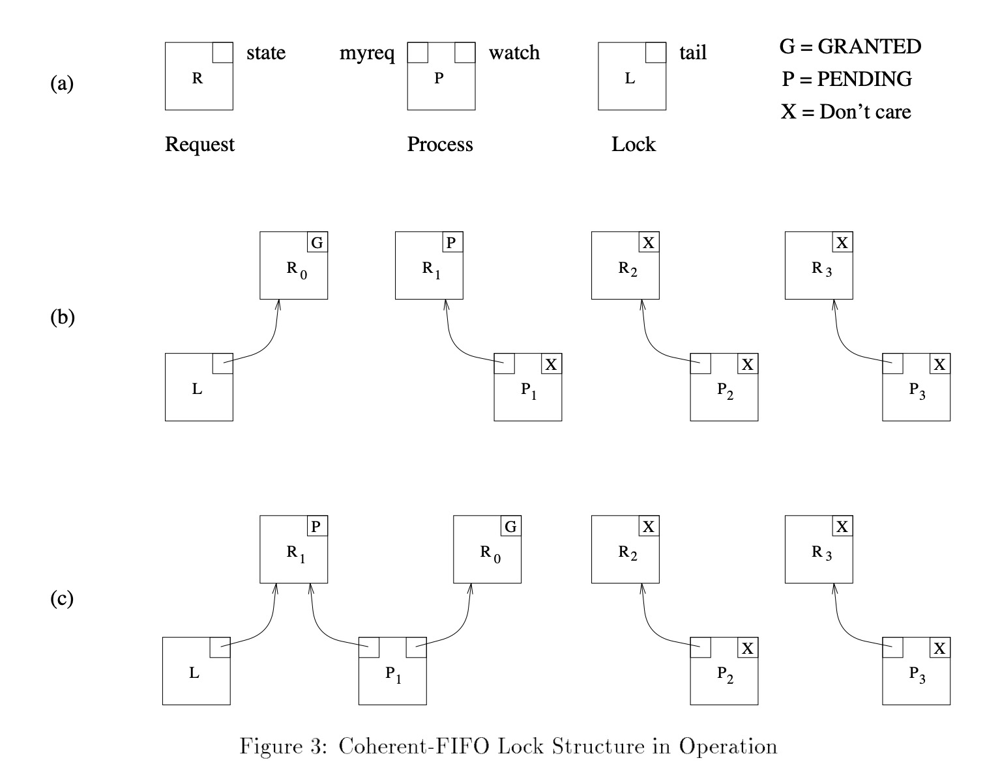
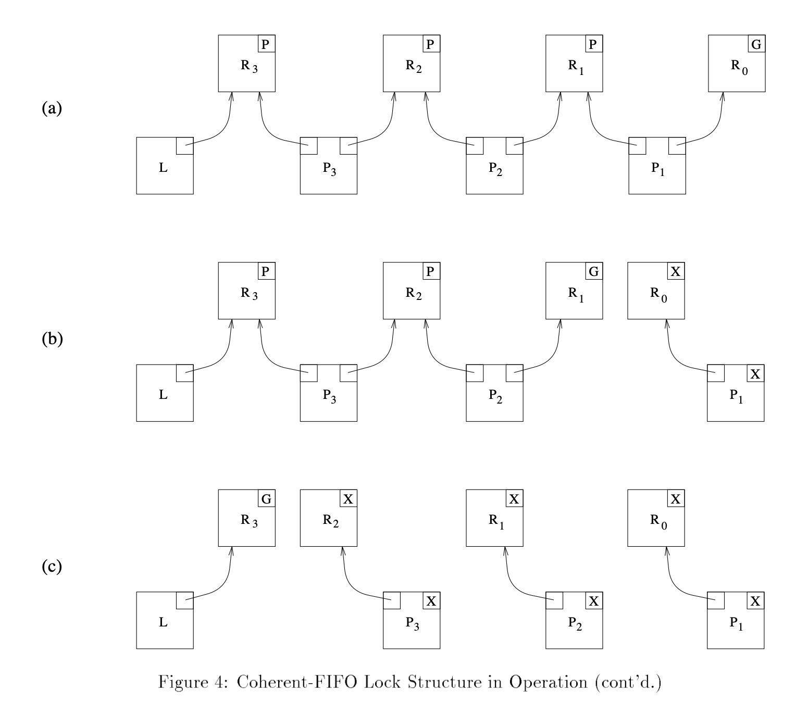

# aqs 一些总结

## aqs提供了什么

### 功能上
    aqs作为java并发包最基础的框架实现，提供一种很底层和通用实现其他同步器(Synchronizers)的方式。它至少提供了以下3个功能，其他的同步器的实现依赖以下三个功能。

    1. atomically managing synchronization state
    2. blocking and unblocking threads
    3. queue

    api层面，aqs需要至少提供两个维度的方法，acquire和release。前者在多个线程争抢时候会阻塞调用的线程直到同步状态允许它继续；后者更改同步状态并且唤醒阻塞的线程。不同的Synchronizers在实现的时候不同的方法都会对应到acquire/release方法上。此外，为了支持Synchronizers更细粒度的语义，aqs还提供了以下三种能力的支持:

    1. nonblocking synchronization attempts (tryLock) as well as blocking versions.
    2. Optional timeout, so application can give up waiting.
    3. Cancellability via interruption, usually separated into one version of acquire that is cancellable, and one that isn't.

    此外aqs支持两种模式的acquire，exclusive和shared方式，比如lock的实现就只用到exclusive，但是semaphores的实现就用到了shared的方式。

    除了以上这些，aqs框架还必须提供了Condition的机制，来模拟monitor-style的await/signal操作。

### 性能上

    总体上是要保持scalability和减少阻塞线程唤醒的等待时延。

    略，以后填坑
   
## aqs预备知识

### 伪代码，基本流程
```
// acquire基本流程
while (synchronization state does not allow acquire) {
    enqueue current thread if not already queued;
    possible block current thread;
}
dequeue current thread if it was queued;

// release基本流程
update synchronization state;
if (state may permit a block thread to acquired) {
    unblock one or more queued thread;
}
```

实现以上3个流程，需要3种技术的实现。

### 同步状态的实现

JSR133中volatile语义保证内存的可见性，在此基础提供了getState,setState,compareAndSetState三种方法来对状态进行获取、更新操作。

(配套vloatile学习，以及JSR133关于JMM相关知识)

### blocking机制

// TODO: 填坑

<!-- JSR136 -->

### queue机制(CLH lock变种实现)

aqs框架的核心在于维护一个阻塞的线程的队列，特别地，在实现上是一个FIFO的队列。

论文中特别提到，直到现在，已经很少有争论在实现同步队列上使用无锁的数据结构是最合适的选择。有两种比较合适的实现:

1. variants of Mellor-Crummey and Scot locks
2. variants of Craig, Landin, and Hagersten locks

aqs使用的是第2种，原因在于比较方便实现cancel和timeout的机制。

#### 原版CLH lock实现

模型定义:

模型中主要定义3个基本概念，基于三个概念上定义了一套加锁解锁流程，需要特别指出，该lock实现是基于自旋锁(等待获取锁采取主动的方式)。

模型有三个要素(对象)组成:

1. Request. 实际上可以认为是一次对锁的请求，包含一个标志位，G代表锁已释放，P标识需要等待锁释放。
2. Lock. 待竞争的锁，包含一个tail属性。
3. Process. 线程。包含一个myreq和watch的属性，代表线程持有的请求和正在观测的请求。

用伪代码稍微描述下就是:

```golang
const (
    RequestStateGranted = 0
    RequestStatePending = 1
)

type Request struct {
    State int
}

type Lock struct {
    Tail *Request
}

type Process struct {
    MyReq *Request
    Watch *Request
}

// NewLock 构造器，初始化一个Lock，需要初始化Lock对应的Request(Granted状态)
func NewLock() *Lock {
    return &Lock{
        Tail: &Request{
            State: RequestStateGranted,
        }
    }
}

// NewProcess 构造器，需要初始化对应的MyReq，具体状态无所谓
func NewProcess() *Process {
    return *Process{
        MyReq: &Request{
            State: RequestStateGranted,
        },
        Watch: nil,
    }
}
```

模型定义后，需要基于此定于两个过程，lock与unlock。

lock的定义: 

1. 将当前process的myreq标记为pending
2. 使用cas操作不断尝试把要获取的lock赋值进去
3. 把原lock对应取出的request放到process的watch中

unlock的定义: 

1. 授权当前process的myreq
2. 把该process的watch赋值给myreq

```golang
func lock(p *Process, lock *Lock) {
    p.MyReq.State = RequestStatePending
    for true {
        old := lock.Tail
        if cas(old, p.MyReq) {
            p.Watch= old
            break
        }
    }

    // 自旋等待watch被授权
    for (p.Watch.State != RequestStateGranted) {}
}

func unlock(p *Process, lock *Lock) {
    p.MyReq.State = RequestStateGranted
    p.MyReq = p.Watch
}

```

分析下这个算法，如下图b，L为初始状态下的Lock，P2,P3为初始的process，P1刚设置状态为
Pending，将要入队。

图c描绘了P1入队，获取锁(进入到临界区)时的状态



下图a描绘,P1获取到锁，P2,P3自旋等待P1释放的状态图；

下图b描绘，P1释放锁，P2获取到锁的状态图；

下图c描绘，所有线程都释放掉锁后，又回到释放状态。



#### aqs对CLH lock的改造实现

aqs中对CLH lock的实现基本做了翻天覆地的改造，原作者也在论文中直言，改造后的实现
已经与原版的实现大相径庭了。

但是核心的思想仍然继承了CLH lock，并且在其中增加了timeout、cancel机制的支持。

拓展:

* aqs拓展的第一点是把自选改造为阻塞，原版实现中，每一个node仅仅认识它的前驱，假如改为block的话，node增加了唤醒后继结点的责任，因此高效定为后继结点的需求使得我们可以额外增加一个next字段(实际上不增加也能定为后继结点，但是需要遍历)
* 增加status字段在每个node上，帮助控制blocking的状态。原版中的"release" bit不足以满足需求，但是仍然需要保证，只有队列头元素才能尝试tryAcquire，头元素也不一定一定能成功，具体规则定义在tryAcquire中。node被取消后仍然需要保留在节点中。(status字段用处: 描述pending、release，描述cancel，减少不需要的park和unpark)
* GC问题。

## aqs基本实现

从以上分析之后可以直接给出一个模板的实现:

```
// acquire 模板实现，阻塞，不可中断，没有超时时间
if (!tryAcquire(arg)) {
    node = create and enqueue new node;
    pred = node's effective predecessor;
    while (pred is not head || !tryAcquire(arg)) {
        if (pred's signal bit is set) {
            park();
        } eles {
            compareAndSet pred's signal bit to true;
        }
        pred = node's effective predecessor;
    }
    head = node;
}

// release 模板实现
if (tryRelase(arg) && head node's signal bit is true) {
    compareAndSet signal bit to false;
    unpark head's successor, if one exists;
}

```

Cancellation的机制只需要在park()返回的时候检查一些interrupt和timeout检查即可，一旦判定为interrupt和timeout，需要把对应node的status设置成相应状态，然后从队列中摘除。


## aqs作为底层框架的Synchronizers实现

### ReentrantLock

### ThreadPoolExecutor.Worker