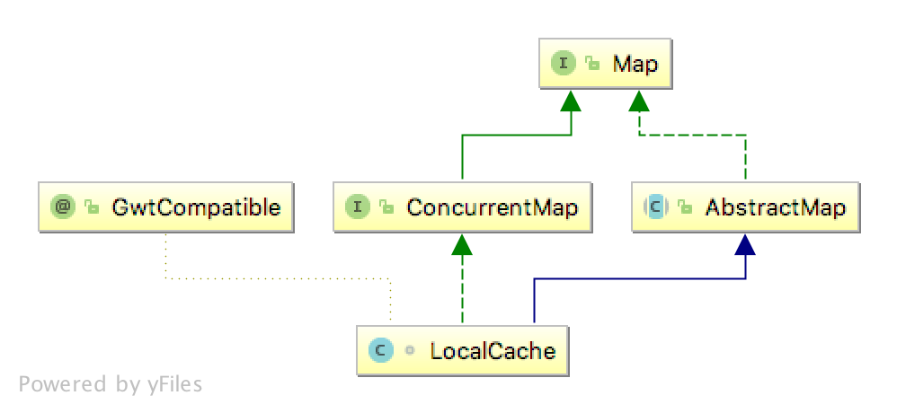
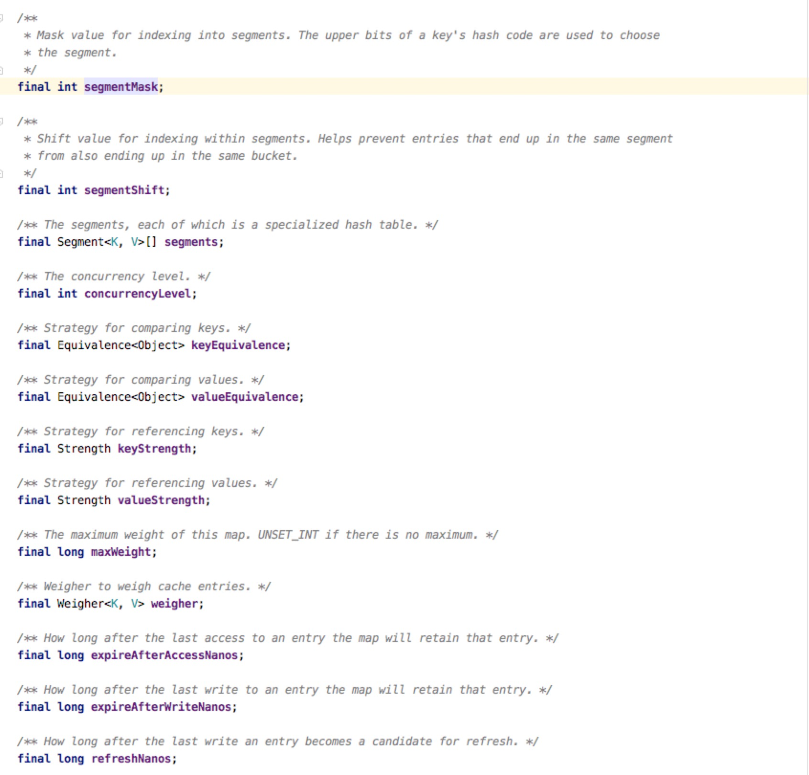
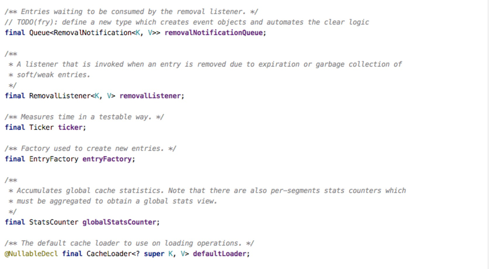
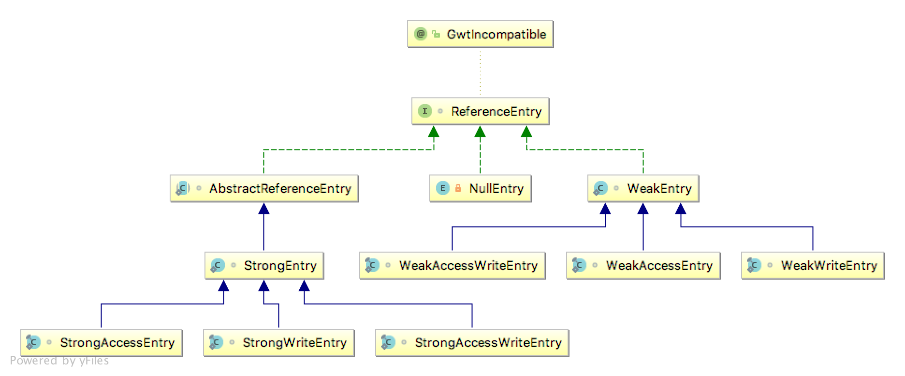
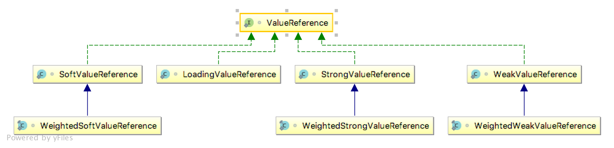

# guava cache

简单说一下，guava的代码质量极高，写法很值得借鉴；其次cache是计算机科学中非常常用且有效的技术，从处理器缓存到到应用程序本地缓存到分布式缓存，缓存的存在意义是存储器的金字塔模型，使用内存可以肯定比硬盘更快。

可以先看下guava提供的基本关于缓存的功能

 1. 清除策略，根据引用类型(由gc决定)、size、根据时间(access time, write time)、手动删除
 2. 删除通知, removal listener，允许用户自定义一些行为，可以异步或者同步(RemovalListeners.asynchronous封装)
 3. refresh策略，相对write time, access time来刷新，通过reload方法来实现，可以同步也可以异步(CacheLoader.asyncReloading封装)
 4. 统计功能
 5. 视图功能

## 数据结构

搞清楚guava-cache核心在于数据结构，它层层调用下底层的数据结构实现是LocalCache

看类图的继承关系就可以知道它实现了ConcurrentMap的语义，因此常见的Map操作都是线程安全的，但是我们的重点是看如何实现清楚策略的，实际上删除通知都很容易想到，统计功能也应该只要的必要的地方插入一个扩展就好，视图的功能可以预见仅仅是这个Map提供的一个功能，那么问题仅仅在于如何处理并发，这可以参考ConcurrentHashMap来看

先看LocalCache保存了哪些状态对象，这些对象在操作过程提供了哪些帮助



有几个值是值得关注的，Segment[],参考了分段锁的实现，把Map分成几个段，每个段持有一把锁，使用更细粒度的实现更好的并发;concurrencyLevel决定了几个分段锁，默认是4;removalListener就是一个删除时候的监听器，存放删除Key,Value的时候回调，可以看出来只能有一个;removalNotificationQueue是一个很有意思的队列，在元素被删除的时候会把对应的事件扔进去，给removalListener调用，是一个暂时存放事件的容器。

LocalCache的很多功能委托给了Segment实现，因此来看看Segment的细节。

在Segment类上有一段总体的介绍告诉我们，segment维护一个哈希表，并且总是处在一个一致的状态，因此不加锁可以直接读;每个node(也就是ReferenceEntry)的next字段都是不可变的(final)。所有的list操作仅在表头操作，因此一旦有元素被删除，必须要重新创建entry，这种情况因为hash table的每个bin上链表长度都不会太大，因此可以很好运行。

在segment有几个数据结构，首先维护一个table，使用的是java.util.concurrent.acomic.AtomicReferenceArray，内部操作时候使用CAS机制达到非阻塞;keyReferenceQueue,valueReferenceQueue都是ReferenceQueue，熟悉java引用类型的都知道，这是用来让weak引用和soft引用被回收的时候能收到通知的一个队列，目的也很清晰，当gc回收之后我们能得到通知把相应的entry清除掉。最有意思的应该还是recencyQueue,writeQueue,accessQueue。当然有个小细节需要额外注意,count字段记录了segment活着的数量，它的声明上有个volatile，这个声明很重要，能够保证内存的可见性，所有写操作在完成的时候一定要写一个volatile，这样才能保证下一个读请求能读到最新数据。

先看WriteQueue, guava为其单独实现了一个Queue, WriteQueue继承AbstractQueue<ReferenceEntry<K, V>>, 设置了一个队列头,添加元素和取元素，仅仅是把Reference的链表关系调整下，操作都是O(1)量级。WriteQueue操作与ReferenceEntry有着密切的关系，ReferenceEntry接口中维护一个双向链表结构标识写的顺序，当entry的nextInWriteQueue是NullEntry的时候就代表已经不在队列里了(这里使用零值的概念来杜绝null的存在，下面也会阐释，是一个很好的借鉴方法)。WriteQueue的head既是头也是尾，可以看做一个环形队列，好处是判断Reference是否存在队列里主要看下一个元素是不是零值就可以。

accessQueue与writeQueue的实现原理也一致，仅仅是在ReferenceEntry的字段变了。

可以看出，accessQueue与writeQueue本身是非线程安全的，在对应的Field上也能看到 @GuardedBy("this")的注解，也能知道，操作这些队列的时候，必须要加锁，并且锁对象本身是this(Segment自己继承了ReentrantLock)。

那么假如说每一个读操作，缓存命中的情况，也需要拿锁来修改accessQueue，肯定是很不好，因此引入了一个recencyQueue，本身就是一个ConcurrentLinkedQueue，每次读只需要更改ConcurrentLinkedQueue(非阻塞)就好。那么什么时候把recencyQueue的数据弄到accessQueue里呢，就是每次持有锁的时候去顺便解决下这个问题，把开销分摊到每次拿到锁的操作上。这种策略在redis中也大量使用。

## 关键路径分析

```java
V get(K key, int hash, CacheLoader<? super K, V> loader) throws ExecutionException {
  checkNotNull(key);
  checkNotNull(loader);
  try {
    if (count != 0) { // read-volatile
      // don't call getLiveEntry, which would ignore loading values
      ReferenceEntry<K, V> e = getEntry(key, hash);
      if (e != null) {
        long now = map.ticker.read();
        V value = getLiveValue(e, now);
        if (value != null) {
          recordRead(e, now);
          statsCounter.recordHits(1);
          return scheduleRefresh(e, key, hash, value, now, loader);
        }
        ValueReference<K, V> valueReference = e.getValueReference();
        if (valueReference.isLoading()) {
          return waitForLoadingValue(e, key, valueReference);
        }
      }
    }
    // at this point e is either null or expired;
    return lockedGetOrLoad(key, hash, loader);
  } catch (ExecutionException ee) {
    Throwable cause = ee.getCause();
    if (cause instanceof Error) {
      throw new ExecutionError((Error) cause);
    } else if (cause instanceof RuntimeException) {
      throw new UncheckedExecutionException(cause);
    }
    throw ee;
  } finally {
    postReadCleanup();
  }
}
```

上来先判断count的数量，由于count是volatile的，因此这步可以保证在这以后看到的内存是最新的(这么说法不准确的，但是确实好理解)。很明显if里面会去判断有没有这个元素，因此根据对应的key和hash找到对应的桶(bucket或者bin?)，拿到ReferenceEntry(getEntry)，还要证明下没有过期且不是正在加载(getLiveValue)，没过期了还要看看需不需要定期刷新(scheduleRefresh)，发现都没问题了就可以返回了。但是如果有一丢丢问题，就排除情况，发现是正在加载(valueReference.isLoading())，那么就等待加载成功就好(实际上会调用valueReference.waitForValue方法)

关键来看lockedGetOrLoad。上来先lock()加锁，先不管CleanUp这些操作，上来直接看根据hash获取Reference，比较key，判断是否在loading、是否已经被垃圾回收、是否已经过期，如果都没有又找到了，直接返回value就好了，这里的过期时间判断是此处新取的时间。为什么外面已经判断了entry不存在，这里又会有存在的情况呢?答案是上面的代码和该出lock的过程有一段时间差，要考虑这段时间差其他线程把改key加载的场景，这也是多线程编程复杂的原因，需要区分很清楚哪里是临界区，在临界区外部的状态，在进入到临界区内后，完全可能改变，需要重新判断。在并发编程中，只有临界区里的状态是可信的，可以不用担心并发，但是临界区外的状态只能说作为一层挡板，为了性能考虑，不要去掺和锁的竞争。

继续看，判断下要不要新创建Entry，如果需要就创建一个LoadingValueReference，其实就是一个占位元素，然后把ValueRefence正确set进去就好，这里可能会复用过期的ValueReference，假如是新创建的只能加到头部，然后解锁，cleanUp，cleanUp等会统一看。
到下面可以看到，这时候同步加载，加锁是用entry的来加锁，使用内置锁synchronized来做，有就是说到加载的时候不可中断的。

loadSync方法是同步加载，真正会执行写入操作，并且来改变segment的结构，可以看到加载操作使用的锁和segment的锁是分离的，通过细粒度的锁使用提高并发。loadSync本身可能平淡无奇，往下看顶多是在Future的用法上不熟悉上可能有点绕，真正关键部分:

```java
boolean storeLoadedValue(
    K key, int hash, LoadingValueReference<K, V> oldValueReference, V newValue) {
  lock();
  try {
    long now = map.ticker.read();
    preWriteCleanup(now);

    int newCount = this.count + 1;
    if (newCount > this.threshold) { // ensure capacity
      expand();
      newCount = this.count + 1;
    }

    AtomicReferenceArray<ReferenceEntry<K, V>> table = this.table;
    int index = hash & (table.length() - 1);
    ReferenceEntry<K, V> first = table.get(index);

    for (ReferenceEntry<K, V> e = first; e != null; e = e.getNext()) {
      K entryKey = e.getKey();
      if (e.getHash() == hash
          && entryKey != null
          && map.keyEquivalence.equivalent(key, entryKey)) {
        ValueReference<K, V> valueReference = e.getValueReference();
        V entryValue = valueReference.get();
        // replace the old LoadingValueReference if it's live, otherwise
        // perform a putIfAbsent
        if (oldValueReference == valueReference
            || (entryValue == null && valueReference != UNSET)) {
          ++modCount;
          if (oldValueReference.isActive()) {
            RemovalCause cause =
                (entryValue == null) ? RemovalCause.COLLECTED : RemovalCause.REPLACED;
            enqueueNotification(key, hash, entryValue, oldValueReference.getWeight(), cause);
            newCount--;
          }
          setValue(e, key, newValue, now);
          this.count = newCount; // write-volatile
          evictEntries(e);
          return true;
        }

        // the loaded value was already clobbered
        enqueueNotification(key, hash, newValue, 0, RemovalCause.REPLACED);
        return false;
      }
    }
    ++modCount;
    ReferenceEntry<K, V> newEntry = newEntry(key, hash, first);
    setValue(newEntry, key, newValue, now);
    table.set(index, newEntry);
    this.count = newCount; // write-volatile
    evictEntries(newEntry);
    return true;
  } finally {
    unlock();
    postWriteCleanup();
  }
}
```

首先这个需要segment的锁，其实这样看可以看做是一个把之前断掉的加载过程连起来，跟hashMap一样，可能需要扩张表的大小(expand)，然后就是一个老流程，这里最后需要检查下原来的元素有没被垃圾回收，有没过期，然后设置新值就好。流程很简单，但是工作量不少

## 常见类的调用关系




## 一些代码借鉴

1. 如何避免null

2. 如何使用Factory模式来实现多态

3. 合适的数据结构已经成功了一半